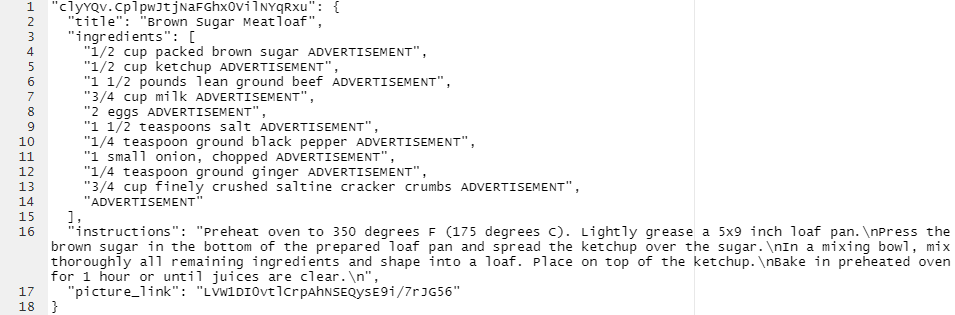
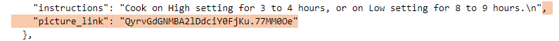
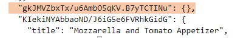

```{r setup, include=FALSE}
knitr::opts_chunk$set(
  echo = TRUE, warning = FALSE, message = FALSE # Show output only, no warnings or messages 
  , tidy=FALSE, tidy.opts=list(width.cutoff=80)  # Line wrapping
  , out.width="75%", fig.align='center'  # For inserting images inline, to be used with the below chunk.
  )
```

```{r load_packages, include=FALSE}
library(knitr)     # Fancy formatting in code chunks such as line wrapping
library(magrittr)  # Pipe operator %>%
library(tidyverse)
library(jsonlite)
library(reticulate)
use_condaenv(condaenv = "IST707", required = TRUE)
library(arules)
library(arulesViz)
library(magrittr)
```

```{python load_python_packages, include=FALSE}
from ingredient_parser.en import parse
import re
import ndjson
```

# Data Preparation

## Selecting Data | Searching

After spending too long rummaging through the Durbin family recipe book, I started to wonder how I could apply data analysis techniques to recipes. 

The Durbin family recipe book sadly only contains less than 1,000 recipes, so external data sources must be found.

The following site provides a .zip file of some recipes scraped from common recipe sites. The recipes as listed in the database are provided under the ODC Attribution License. 

- https://eightportions.com/datasets/Recipes
  - recipes-raw.zip
    - recipes_raw_nosource_fn.json:  Foodnetwork.com
    - recipes_raw_nosource_epi.json: Epicurious.com
    - recipes_raw_nosource_ar.json:  Allrecipes.com

## Selecting Data | Exploring
The data from Allrecipes.com is messy. I deleted all instances of ` ADVERTISEMENT` and `,\n    "ADVERTISEMENT"`. Example below.



Once that was completed, the three data files looked similar in format.

## Selecting Data | Cleaning
I removed the picture_link entries in all three files using the regular expression:

```
,\n\s*"picture_link": .*\n
```



## Selecting Data | Cleaning Pt. 2
I also had to remove some "empty" recipes. This regex helped:

```
\s{2}"[a-zA-Z0-9/.]*": \{\},\n
```




## Parsing Ingredients
I want to remove as much redundant information as I can from each list of ingredients. This will help in the association rule mining analysis. There is a python package that does just this.

```{python echo=FALSE}
from ingredient_parser.en import parse

print(f'''Original ingredient:
  '1 1/2 cups sugar'
After parsing:
  '{parse('1 1/2 cups sugar')['name']}'
''')
```

Works great in that case, but not great in others.

```{python echo=FALSE}
print(f'''Original ingredient:
  '2 cups (about 9 1/2 ounces) whole almonds, toasted'
After parsing:
  '{parse('2 cups (about 9 1/2 ounces) whole almonds, toasted')['name']}'
''')
```


## Parsing Ingredients Part 2
I wrote a simple regex to remove unwanted elements that the python parser might miss.

```{python}
import re

def rparse(i):
  pattern = r"""(?x)  # Use free-spacing mode.
      \s?\(.*\)\s?|   # something in parentheses with a space before/after
      ,.*$            # from a comma to the end of the string
      """
  return re.sub(pattern, "", i)
```


## Extract Relevant Information
With the python parser (and the function I wrote) I can now write code to extract the information I need. 

- For association rule mining (AR), I need the names of all ingredients. 
- For text mining (TM), I need the instructions for each recipe.

```{python, eval=FALSE}
files = ['ar', 'epi', 'fn']

for file_name in files:
  with open(f'data/recipes_raw_ndjson/recipes_raw_nosource_{file_name}.json') as f:
    data = ndjson.load(f)

  # AR: gather ingredient lists, parse, and write to a new file.
  data_ingredients = [recipe['ingredients'] for recipe in data]

  data_ingredients = [
    [rparse(parse(ingredient)['name']).lower() for ingredient in ingredients] 
      for ingredients in data_ingredients
    ]

  with open(f'data/recipes_raw_ndjson/ingredients_{file_name}.txt', 'w') as f:
    for ingredients in data_ingredients:
        f.write(','.join(ingredients))
        f.write('\n')
  
  # TM: gather instructions and write to a new file
  data_instructions = [recipe['instructions'] for recipe in data]
  
  with open(f'data/recipes_raw_ndjson/instructions_{file_name}.txt', 'w') as f:
    for instruction in data_instructions:
      f.write(instruction)
      f.write('\n')
```


# Models

## Association Rule Modeling

To perform association rule mining, a list of sets of items must first be collected. In the case of this project, that consists of a list of ingredients for multiple recipes. This is similar to the common "shopping cart example" where each cart represents one list of items, then data from multiple shopping carts is collected. The data used in this project is stored as shown in the example below.

```
egg whites,egg yolks,sugar,brandy,rum
fresh chestnuts,veal stew meat,olive oil,chopped onion,chopped garlic,bay leaf
brown sugar,heavy cream,whole milk,pure vanilla extract,ground cinnamon
whole almonds,sugar,ground cinnamon,salt,large egg,large egg white,almond extract
butter,flour,milk,salt,freshly ground pepper
```

The `read.transactions` function understands this data as basket-type transaction data. Using the `arules` library, we can conduct an analysis on the data using the apriori algorithm. 

## Text Mining

This method of analysis involves breaking text into tokens, or individual words. In the case of this project, that involves obtaining a list of every individual word used in every recipe, unsorted and otherwise unmodified. From there, common and uninteresting words / characters are removed. These are referred to as stopwords. The text is also converted to lower-case for ease of analysis as individual sentences are not the priority - the collection of words (corpus) is. 

The filtered and lowercase words are then stored as bigrams and rated according to raw frequency and a measure called Pointwise Mutual Information, or PMI. PMI is basically the likelihood of co-occurence of words. 

The instructions are stored in a text file with each line containing the instructions from one recipe.


# Analysis

## Association Rule Modeling

First, read in the previously formatted and stored data.

```{r cache=TRUE}
data.ar <- read.transactions("data/recipes_raw_ndjson/ingredients_ar.txt", format = "basket", sep = ",")
```

Next, check the size of the data.

```{r}
dim(data.ar)
```

So, `r dim(data.ar)[1]` transactions and `r dim(data.ar)[2]` unique items.

Finally, generate a rule set and sort it to view the most interesting rules.

```{r}
rules <- apriori(
  data.ar, 
  parameter = list(
    supp = 0.001, 
    conf = 0.5, 
    maxlen = 3  # max number of items in a rule
  )
)

rules.sort <- sort(rules, by=c("confidence","lift"), decreasing=TRUE)
```

The sorted rule set can be converted to a dataframe for formatting and better output.

```{r}
# only use the top 20 rows
df <- DATAFRAME(rules.sort[1:20,]) 

# rownames take on large values at this point, which is unnecessary
rownames(df) <- NULL 

# view the rules along with the support, confidence, and lift.
df %>% 
  select(!c(coverage,count)) %>% 
  rename(supp="support",conf="confidence") %>% 
  mutate_at(3:5, list(~ round(., 3)))
```

Interestingly, most ingredient combinations are reminiscent of common autumn recipes such as zucchini bread and pumpkin pie. 

## Text Mining

First, import relevant packages and read in the data. 

```{python}
# open python and nltk packages needed for processing
import nltk
import re

filepath = 'data/recipes_raw_ndjson/instructions_ar.txt'

# open the file, read the text and close it
f = open(filepath, 'r')
filetext = f.read()
f.close()
```

Next, tokenize the file (or break sentences into individual words).

```{python}
filetokens = nltk.word_tokenize(filetext)
```

Convert each word to lowercase. This de-emphasizes the beginnings of sentences, but such information isn't relevant to this analysis.

```{python}
filetokens_lower = [w.lower() for w in filetokens]
```

Preview the first few tokens.

```{python}
print(len(filetokens_lower))
print(filetokens_lower[:30])
```

There are lots of tokens, but the next sections will remove a significant amount of redundant words and characters. 

Next, open a file containing a pre-defined list of stopwords. Add in some extra stopwords that are specific to this corpus.

```{python}
fstop = open('data/smart.english.stop', 'r')
stoptext = fstop.read()
fstop.close()

stopwords = nltk.word_tokenize(stoptext)
stopwords.extend(['small', 'medium', 'large', 'medium-high', 'high', 'low'])
print(stopwords[:50])
```

Define a filter to remove non-alphabet characters such as parentheses and numbers.

```{python}
def alpha_filter(w):
    pattern = re.compile('^[^a-z]+$')
    if (pattern.match(w)):
        return True
    else:
        return False
```

Finally, initialize an object to carry bigrams generated from the recipe instructions.

```{python}
from nltk.collocations import *
bigram_measures = nltk.collocations.BigramAssocMeasures()

finder = BigramCollocationFinder.from_words(filewords)

finder.apply_word_filter(alpha_filter)
finder.apply_word_filter(lambda w: w in stopwords)
```

With the model trained, view the top 20 bigrams sorted by raw frequency and PMI.

```{python}
scored = finder.score_ngrams(bigram_measures.raw_freq)
for item in scored[:20]:
    print(item)
```

Next, PMI:

```{python}
finder.apply_freq_filter(5)
scored = finder.score_ngrams(bigram_measures.pmi)
for item in scored[:20]:
    print(item)
```

## Results: Association Rule Mining

## Results: Text Mining

## Conclusions

Favorite recipe:

```
{
  "instructions": "heat bacon, eat it",
  "ingredients": [],
  "title": "Fruit Butter"
}
```

